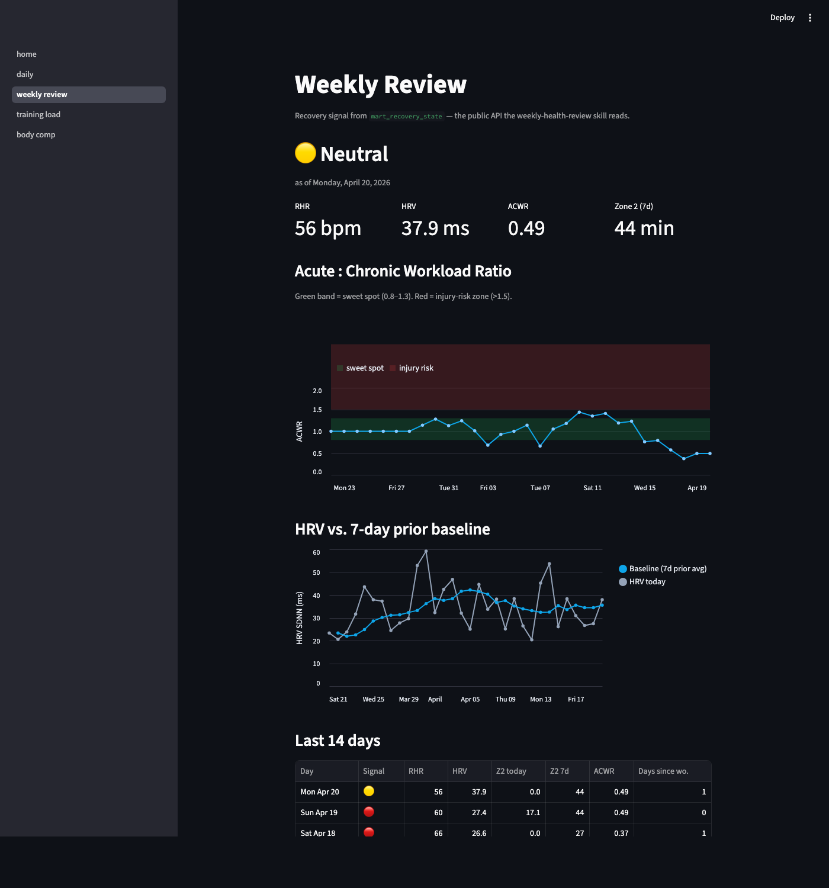
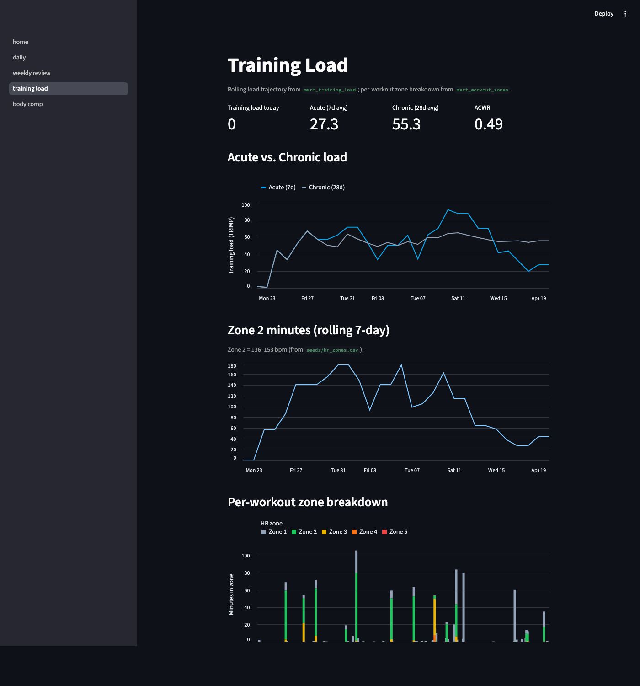
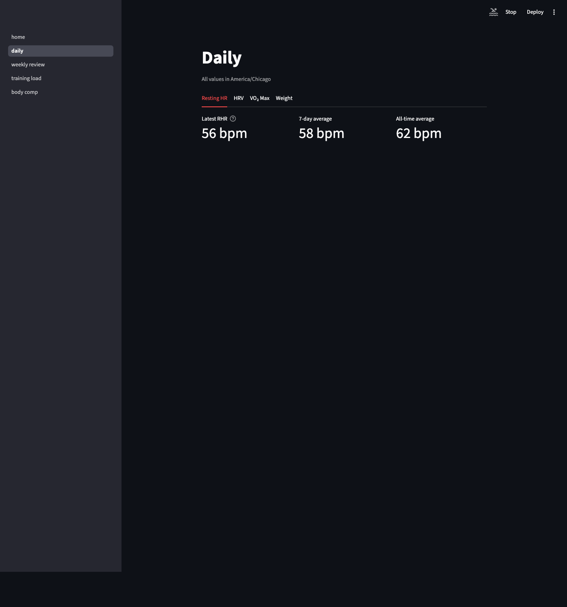
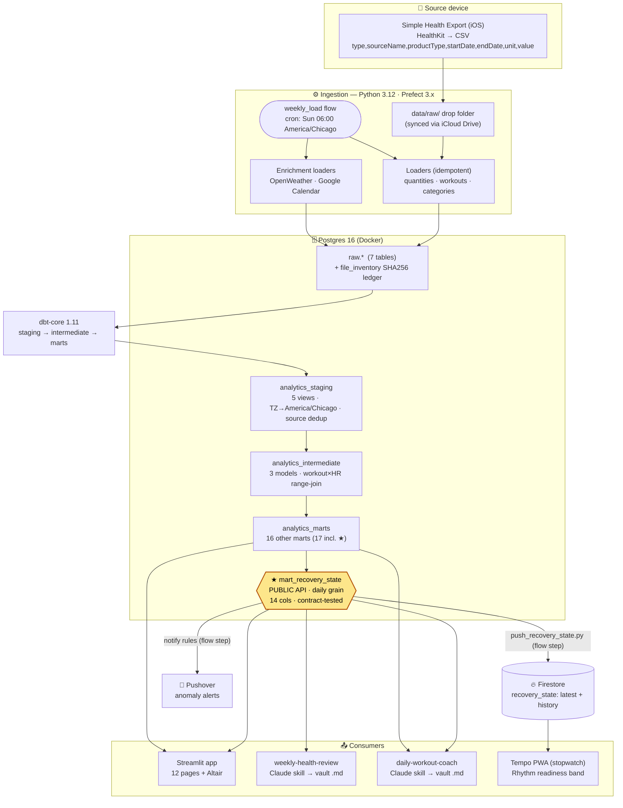

# personal-health-elt

[](https://github.com/ksdisch/personal-health-elt/actions/workflows/ci.yml)
[](https://www.python.org/downloads/release/python-3120/)
[](https://docs.getdbt.com/)
[](LICENSE)

A personal Apple Health ELT pipeline, end to end. CSV exports from a
HealthKit-compatible iOS app land on disk, get loaded into Postgres,
transformed with dbt into analytics-ready marts, and visualized in a
Streamlit app. The apex mart (`mart_recovery_state`) is a versioned
public API with **three** downstream consumers — the `weekly-health-review`
and `daily-workout-coach` Claude skills, and a one-way Firestore feed to
the Tempo PWA. Its full contract lives in the
[data dictionary](docs/reference/data-dictionary.md).

This is also a **portfolio project for Analytics Engineer / Data
Engineer roles**, so code quality, dbt conventions, and design choices
are part of the deliverable.

## Live app

_TODO: paste the deployed Streamlit URL here once the cloud deploy
lands. The full step-by-step is in_ [`docs/DEPLOYMENT.md`](docs/DEPLOYMENT.md)
_— it covers managed Postgres provisioning (Supabase / Neon / Railway),
secrets, cold-start ingest, three deploy targets (Streamlit Cloud /
Fly / Railway), and the redeploy path._

## What this demonstrates

| Skill area | In this repo |
| --- | --- |
| **Idempotent ingestion** | SHA256 file ledger + ON CONFLICT row-level dedup, in one transaction. Re-running any loader is safe. |
| **Range-based SQL** | `int_workout_hr_samples` joins HR samples to workout windows; LEAD() computes per-sample duration; materialized as table to amortize the cost. |
| **dbt layering** | Strict `staging → intermediate → marts`. Marts never select from `source()`. Layer-level tests on every model. |
| **Public-API contract** | `mart_recovery_state` is a versioned interface with **three** consumers, enforced via dbt `accepted_values` + `unique` tests and documented in a [data dictionary](docs/reference/data-dictionary.md). |
| **Multi-source dedup** | Apple Watch > iPhone > third-party — encoded as a `source_priority` window function in staging. |
| **Time correctness** | UTC at rest, `America/Chicago` everywhere downstream. TZ conversion lives in exactly one layer. |
| **Date-spine rolling windows** | `mart_training_load` generates a contiguous date series so 7-day / 28-day rolling averages denominate correctly through zero-load days. |
| **Pure-SQL forecasting** | `holt_forecast` macro implements Holt's linear method (level + trend) with `WITH RECURSIVE` — `mart_forecast_bands` + a walk-forward `mart_forecast_backtest`, no Python ML dependency. |
| **Real Streamlit UX** | 12 pages including a Weekly Review with an Altair-rendered ACWR chart on color-coded sweet-spot / injury-risk bands. |
| **Closed-loop integration** | dbt mart → Python generators → vault Markdown / Firestore → three consumers — all idempotent and recoverable. |

**Scale of real data flowing through right now:** 676,927 quantity samples across 35 metric types · 186 workouts · 72,331 HR samples range-joined to workout windows · 68 daily recovery-state rows · 61 scored sleep nights — all loaded idempotently and rebuilt end-to-end.

## Screenshots

### Weekly Review — `mart_recovery_state` consumer surface

The headline page. Recovery signal as a colored badge, ACWR trajectory on green sweet-spot / red injury-risk bands, HRV vs. 7-day prior baseline, and the last 14 days as a sortable table. The "What the skill sees" expander at the bottom shows the exact JSON payload that goes to the `weekly-health-review` Claude skill.



### Training Load — the SQL interesting bits made visual

Acute (7d) vs. chronic (28d) load lines, rolling Zone 2 minutes, and a per-workout zone-stack chart colored by intensity (Zone 1 grey → Zone 5 red). Each bar is one workout's actual time-in-zone, computed from the `int_workout_hr_samples` range-join.



### Daily — per-metric tabs

Resting HR, HRV, VO₂ Max, and Weight tabs with a shared 3-card-and-trend layout. The Weight tab shows an empty-state hint (no smart scale data yet — the `mart_daily_weight` mart is shipped and waiting).



## Architecture



The diagram source lives in [`docs/diagrams/system-context.mmd`](docs/diagrams/system-context.mmd);
the keyed raw-layer ERD (PK/FK/indexes) is in [`docs/diagrams/raw-erd.dbml`](docs/diagrams/raw-erd.dbml).

The dbt layer is **strict** `staging → intermediate → marts`: 5 staging views,
3 intermediate models, and 17 marts (`mart_recovery_state` + 16 others — full
catalog in the [data dictionary](docs/reference/data-dictionary.md)). Marts never
select from `source()`. Prefect schedules `weekly_load` on Sunday 06:00 CT to
refresh raw + dbt, then feeds the three `mart_recovery_state` consumers.

## App pages

Twelve Streamlit pages under `app/pages/` (plus `home.py`), each backed by marts:

| Page | What it shows | Key marts |
| --- | --- | --- |
| `01_daily` | Per-metric tabs (RHR / HRV / VO₂ max / weight) | `mart_daily_rhr`, `mart_daily_hrv`, `mart_daily_vo2max`, `mart_daily_weight` |
| `02_weekly_review` | Recovery signal + ACWR bands (the headline page) | `mart_recovery_state` |
| `03_training_load` | Acute/chronic load, Zone 2, per-workout zones, HRR | `mart_training_load`, `mart_workout_zones`, `mart_workout_hrr` |
| `04_body_comp` | Body composition trend | _stub — Week 2 TODO_ |
| `05_year_view` | Year-in-pixels heatmap | `mart_recovery_state`, `mart_training_load` |
| `06_anomaly` | z-score anomaly dashboard (\|z\| > 2) | `mart_daily_anomaly_bands` |
| `07_readiness` | Readiness quadrant | `mart_recovery_state`, `mart_workout_zones` |
| `08_aerobic_efficiency` | Z2 efficiency drift | `mart_monthly_aerobic_efficiency`, `mart_daily_vo2max` (+ `hr_zones` seed) |
| `09_correlations` | Lagged correlations vs. external context | `mart_daily_signals`, `mart_daily_context` |
| `10_ask` | Conversational "Ask your health data" (Claude over the marts) | dbt manifest + marts |
| `11_forecast` | 7-day Holt forecasts + backtest accuracy | `mart_forecast_bands`, `mart_forecast_backtest` |
| `12_sleep` | Hypnogram, nights, naps | `mart_sleep_nights`, `mart_sleep_naps`, `mart_sleep_stages` |

## Stack

| Layer          | Tool                              |
| -------------- | --------------------------------- |
| Language       | Python 3.12 (managed by `uv`)     |
| Database       | Postgres 16 (Docker)              |
| Orchestration  | Prefect 3.x                       |
| Transforms     | dbt-core + dbt-postgres           |
| Visualization  | Streamlit + Altair                |
| Lint / Test    | Ruff, pytest, mypy                |
| CI             | GitHub Actions (ruff · mypy · pytest+cov · dbt parse · dbt build) |

## Roadmap

**Weeks 1–4 — Foundations → skill integration.** ✅ Idempotent file inventory +
generic quantities loader (35 metric types), workouts loader, the
`int_workout_hr_samples` range-join, `mart_workout_zones` / `mart_training_load`
(TRIMP + ACWR), the `mart_recovery_state` public API, the Prefect weekly flow
(Sun 06:00 CT), and the first `weekly-health-review` skill consumer.

**Shipped since (PRs #5–#31).** ✅ Sleep analytics stack (hypnogram + nights/naps +
composite score), per-workout HRR, OpenWeather + Google Calendar enrichment marts,
the anomaly → Pushover notification pipeline, a conversational "Ask" page (Claude
over the marts), pure-SQL Holt's-method forecasting + walk-forward backtest, a
second consumer (`daily-workout-coach`) and a third (the Tempo PWA Firestore feed),
self-hosted Prefect via launchd, dbt source-freshness checks, and mypy + coverage
in CI. The app is now **12 pages over 17 marts**.

**Next.** See [`BACKLOG.md`](BACKLOG.md) for the live, typed backlog and
[`docs/artifacts-plan.md`](docs/artifacts-plan.md) for the docs roadmap (ADRs,
CHANGELOG, dbt-lineage diagram, forecasting design doc).

## Local setup

```bash
# 1. Start Postgres + pgAdmin (pgAdmin on localhost:5050)
docker compose up -d

# 2. Wire credentials
cp .env.example .env
cp transform/profiles.yml.example transform/profiles.yml

# 3. Install deps
uv sync

# 4. Create the raw schema
docker exec -i health_postgres psql -U health -d health \
  < scripts/init_raw_schema.sql

# 5. Verify dbt ↔ Postgres
uv run dbt debug --project-dir transform --profiles-dir transform

# 6. Load HR zones seed
uv run dbt seed --project-dir transform --profiles-dir transform

# 7. Drop your HealthKit-export CSVs into data/raw/, then load them all
uv run python -m ingest.loaders.batch data/raw/

# 8. Build the marts
uv run dbt build --project-dir transform --profiles-dir transform

# 9. Run the Streamlit app
uv run streamlit run app/home.py
```

## Pre-commit hooks (optional but recommended)

Local gates that mirror CI — catch lint / format / type errors before
they hit a branch. One-time install:

```bash
uv tool install pre-commit
pre-commit install --hook-type pre-commit --hook-type pre-push
```

After install, `git commit` runs `ruff check` + `ruff format --check`
and `git push` adds `mypy ingest` (slower, so push-only). Configuration
lives in `.pre-commit-config.yaml` at repo root.

To run the hooks manually against all files:

```bash
pre-commit run --all-files          # pre-commit hooks (fast)
pre-commit run --hook-stage pre-push --all-files
```

## Scheduled refresh

The Prefect flow `ingest.flows.weekly_load` is the full weekly refresh: it
walks `data/raw/`, loads any new HK CSVs through the batch dispatcher, backfills
weather + calendar, runs `dbt build` against the real schema, evaluates
notification rules, and pushes `mart_recovery_state` to Firestore. It's
idempotent — re-running on a clean folder is a no-op.

```bash
# Run once:
uv run python -m ingest.flows.weekly_load

# Self-hosted scheduler — creates the deployment + runs the cron (Sunday 06:00 CT):
uv run python -m ingest.flows.weekly_load --serve
```

`--serve` runs a self-hosted Prefect deployment (`flow.serve()`) that stays
alive and fires weekly. Pair it with `caffeinate` or a launchd plist to survive
sleep. Full setup, schedule rationale, manual-run, and the laptop-bound
tradeoff are in [docs/automation.md](docs/automation.md).

## Feed the consumers

`mart_recovery_state` has three downstream consumers (see the
[data dictionary](docs/reference/data-dictionary.md) for the full contract):

```bash
# 1. weekly-health-review skill — weekly H2 briefing to stdout (→ vault)
uv run python scripts/weekly_health_review.py

# 2. daily-workout-coach skill — today's session card to stdout (→ vault)
uv run python scripts/daily_workout_coach.py

# 3. Tempo PWA — push latest + 14-day history to Firestore (no-op without creds)
uv run python scripts/push_recovery_state.py --dry-run
```

The weekly briefing pipes a complete H2 block — signal headline, day-by-day
table, and 1–4 prescriptive recommendations from real rules (ACWR sweet spot,
HRV trend, Zone 2 deficit, strain-day count). All three run as steps of the
`weekly_load` flow, and each is independently re-runnable.

## Common commands

A cheat sheet for day-to-day operation. All commands run from the project root.

```bash
# Daily ops
uv run python -m ingest.loaders.batch data/raw/      # load any new HK CSVs (idempotent)
uv run dbt build --project-dir transform --profiles-dir transform   # rebuild marts + run all tests
uv run python scripts/weekly_health_review.py        # generate this week's briefing markdown
uv run streamlit run app/home.py                     # serve the dashboard

# Verification (instant, run any time)
uv run ruff check .                                  # lint
uv run pytest                                        # unit tests (37, ~0.5s)
uv run dbt parse  --project-dir transform --profiles-dir transform  # dbt syntax check
uv run dbt debug  --project-dir transform --profiles-dir transform  # connection test
docker compose ps                                    # are the containers up?

# DB introspection
docker exec -i health_postgres psql -U health -d health   # interactive psql
docker exec -i health_postgres psql -U health -d health -c "\
  SELECT 'quantities' AS tbl, COUNT(*) FROM raw.quantities \
  UNION ALL SELECT 'workouts', COUNT(*) FROM raw.workouts \
  UNION ALL SELECT 'recovery', COUNT(*) FROM analytics_marts.mart_recovery_state;"
```

## Read the code

Direct links to the most interesting files, in case you're skimming:

- [`transform/models/marts/mart_recovery_state.sql`](transform/models/marts/mart_recovery_state.sql) — the public-API mart. Contract-tested with `accepted_values` on `recovery_signal` and `unique(day)`.
- [`transform/models/intermediate/int_workout_hr_samples.sql`](transform/models/intermediate/int_workout_hr_samples.sql) — the range-join (workouts × HR samples) plus `LEAD()` per-sample duration. Materialized as a table to amortize cost.
- [`transform/models/marts/mart_training_load.sql`](transform/models/marts/mart_training_load.sql) — date-spine + rolling 7-day acute / 28-day chronic + ACWR. The denominate-correctly-through-rest-days move.
- [`transform/macros/holt_forecast.sql`](transform/macros/holt_forecast.sql) — Holt's linear method (level + trend) in pure SQL via `WITH RECURSIVE`. Powers `mart_forecast_bands` + `mart_forecast_backtest`.
- [`transform/models/staging/stg_quantities.sql`](transform/models/staging/stg_quantities.sql) — TZ normalization + multi-source dedup (Apple Watch > iPhone > other) via `row_number()`.
- [`ingest/loaders/quantities.py`](ingest/loaders/quantities.py) — two-level idempotency: SHA file ledger + ON CONFLICT row dedup, both inside `engine.begin()`.
- [`ingest/loaders/workouts.py`](ingest/loaders/workouts.py) — unit-embedded value parser (`"659.283 kcal"` → `659.283`), tolerant of missing columns per activity type.
- [`scripts/weekly_health_review.py`](scripts/weekly_health_review.py) — briefing generator. Rule-based recommendations (ACWR sweet-spot, HRV trend, Z2 deficit, strain count).
- [`app/pages/02_weekly_review.py`](app/pages/02_weekly_review.py) — the Streamlit page screenshotted above. Altair layered chart with `mark_rect` bands.
- [`transform/seeds/hr_zones.csv`](transform/seeds/hr_zones.csv) — HR zones as configuration. Zone 2 locked at 136–153 bpm.
- [`docs/reference/data-dictionary.md`](docs/reference/data-dictionary.md) — the public-API contract (mart columns + `recovery_signal` enum + Firestore shape), the full 17-mart catalog, and a domain glossary.
- [`docs/diagrams/`](docs/diagrams/) — `system-context.mmd` (architecture, Mermaid) + `raw-erd.dbml` (raw-layer ERD, DBML).

## Project structure

```
personal-health-elt/
├── ingest/                  Python — config, file inventory, loaders, Prefect flow
│   ├── loaders/             quantities · workouts · categories · weather · calendar
│   ├── flows/weekly_load.py Prefect flow + Sun 06:00 CT cron
│   └── notifications/       anomaly rules → stdout + Pushover
├── transform/               dbt project (staging → intermediate → marts)
│   ├── models/
│   │   ├── staging/         5 views — TZ→America/Chicago + source-priority dedup
│   │   ├── intermediate/    int_workout_hr_samples (range-join) + sleep periods/segments
│   │   └── marts/           17 marts — daily physiology · training · sleep · forecast
│   │                        + mart_recovery_state★ (public API)
│   ├── seeds/               hr_zones (Zone 2 = 136–153 bpm) + sleep_score_weights
│   ├── macros/              holt_forecast + rolling_trailing
│   └── tests/               schema + singular tests
├── app/                     Streamlit — home + 12 numbered pages + lib/queries.py
├── scripts/
│   ├── init_raw_schema.sql      raw schema bootstrap
│   ├── weekly_health_review.py  weekly briefing   → vault
│   ├── daily_workout_coach.py   daily session card → vault
│   └── push_recovery_state.py   Firestore feed     → Tempo PWA
├── docs/
│   ├── reference/data-dictionary.md   mart_recovery_state contract + 17-mart catalog
│   ├── diagrams/                       system-context.mmd + raw-erd.dbml
│   ├── automation.md · DEPLOYMENT.md   runbooks
│   └── artifacts-plan.md               docs roadmap
└── tests/                   pytest unit tests for loaders + parsers
```

## Portfolio notes

A few deliberate design choices worth calling out:

- **Idempotent loaders, two levels.** Apple re-exports contain full
  history. Loaders dedup at the file level (SHA256 ledger in
  `raw.file_inventory`) AND at the row level (`ON CONFLICT (metric_type,
  source_name, start_ts) DO NOTHING`). Both happen in one transaction —
  a failed insert rolls back the file_inventory record, so retry is
  clean. Real bug found and fixed: pandas `NaN` in object columns lands
  in Postgres TEXT as the literal string `"NaN"` unless coerced to
  `None` at the record boundary. Caught by running on real data, not
  by tests.

- **The interesting SQL.** `int_workout_hr_samples` cross-joins 186
  workouts against the HR-sample stream, filters by time range, tags each
  sample with a zone via `BETWEEN` against the `hr_zones` seed, and uses
  `LEAD()` to compute per-sample duration (`coalesce(next_ts,
  workout_end_ts) - current_ts`) — 72k tagged samples result. Originally
  a view; materialized as a table after profiling — the join is the
  biggest cost in the project, and every downstream mart + test
  re-executes it. Materialization drops downstream reads from seconds to
  microseconds.

- **Date-spine rolling averages.** `mart_training_load` `generate_series`'s
  the observed range so zero-load days count as 0, not "missing". 7-day
  acute and 28-day chronic averages denominate correctly through rest
  weeks. ACWR = acute/chronic; sweet spot 0.8–1.3, injury risk > 1.5.
  Foot-gun avoided by design.

- **`mart_recovery_state` as a versioned interface.** Schema enforced
  via dbt `accepted_values` (`recovery_signal IN ('well_recovered',
  'neutral', 'strained', 'insufficient_data')`) and `unique(day)`.
  It now has **three** consumers (weekly-health-review skill, the Tempo
  PWA Firestore feed, and daily-workout-coach) — changes require updating
  all three in lockstep, and the test fails before any consumer does. The
  contract is documented in [`docs/reference/data-dictionary.md`](docs/reference/data-dictionary.md).

- **Multi-source dedup priority.** When the same metric comes from
  multiple devices, staging picks the winner via `source_priority`:
  Apple Watch (1) > iPhone (2) > third-party (3). Encoded as a
  `row_number() OVER (PARTITION BY metric_type, start_ts ORDER BY
  source_priority)` in `stg_quantities`, filtered to rank 1.

- **Time correctness lives in exactly one place.** `start_ts` lands in
  the warehouse as UTC. Staging is the only layer that converts to
  `America/Chicago`. Intermediate and marts treat local time as
  authoritative. If anything downstream sees a UTC timestamp, that's
  a bug in staging — not a "fix it everywhere" panic.

- **HR zones are config, not code.** Zone 2 is locked to 136–153 bpm
  in `transform/seeds/hr_zones.csv` (the user's measured Zone 2). A
  workout-zones change requires a seed edit + `dbt seed`, not a SQL
  migration.

- **Rule-based recovery signal, not ML.** `mart_recovery_state.recovery_signal`
  is a 3-tier bucket from explicit rules (`acwr > 1.5 → strained`,
  `hrv < 0.85 × baseline → strained`, etc.). The bucket is a hint;
  raw inputs (`rhr_bpm`, `hrv_ms`, `acwr`, `days_since_last_workout`)
  are also exposed. The downstream skill can override the bucket but
  shouldn't have to recompute the inputs.

- **Pure-SQL forecasting, no Python ML.** The `holt_forecast` macro
  fits Holt's linear method (level + trend, α=0.3 β=0.1) with a
  `WITH RECURSIVE` walk over the daily series. `mart_forecast_bands`
  adds heuristic confidence bands and `mart_forecast_backtest` does a
  walk-forward MAE/RMSE/MAPE — all in the warehouse, so the forecast
  rebuilds with every `dbt build`.

- **Closed-loop skill integration.** The full chain works:
  `Apple Watch → Postgres → mart_recovery_state → Python generators →
  vault Markdown / Firestore → weekly-health-review + daily-workout-coach
  skills + Tempo PWA Rhythm view`. Every step is idempotent and
  re-runnable.

- **CI green from day one.** `ruff`, `mypy`, `pytest` (+ coverage),
  `dbt parse`, and a full `dbt build` against a fresh Postgres run on
  every push. Real-data integration tests are manual locally; CI stays
  hermetic.
